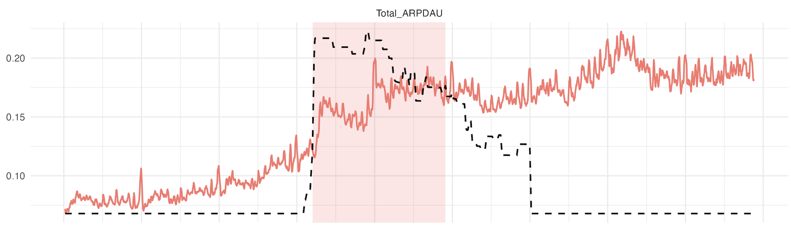
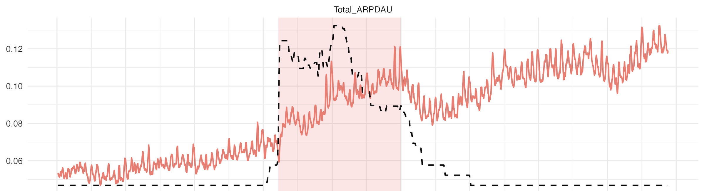
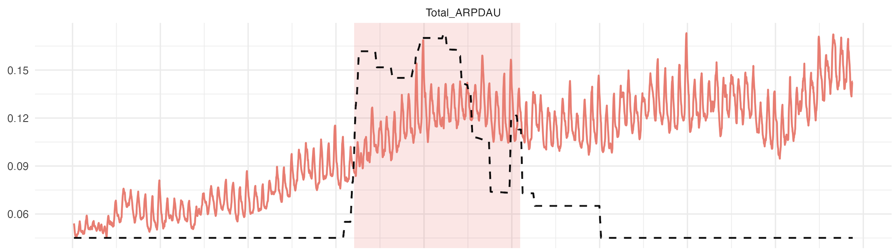
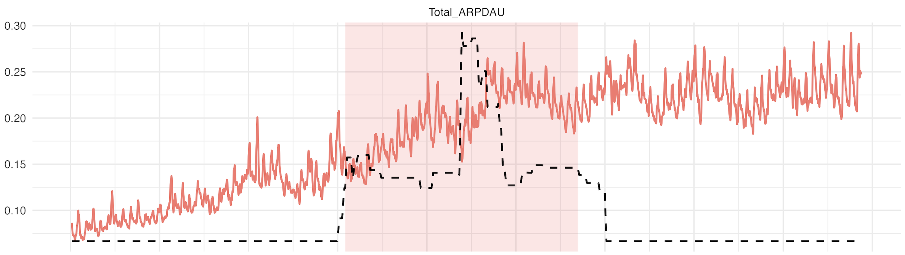
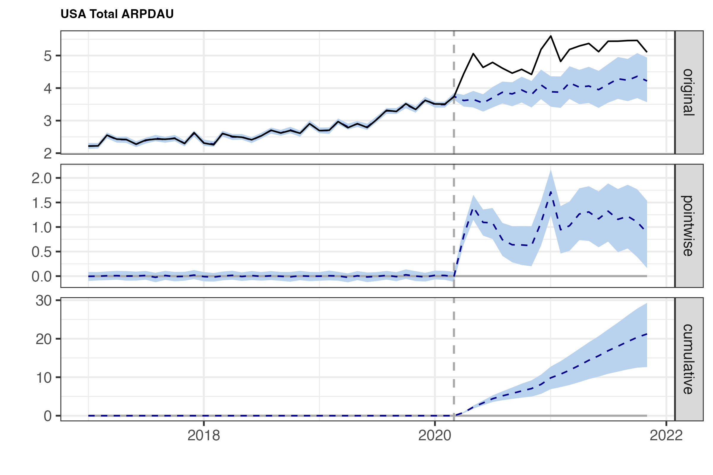
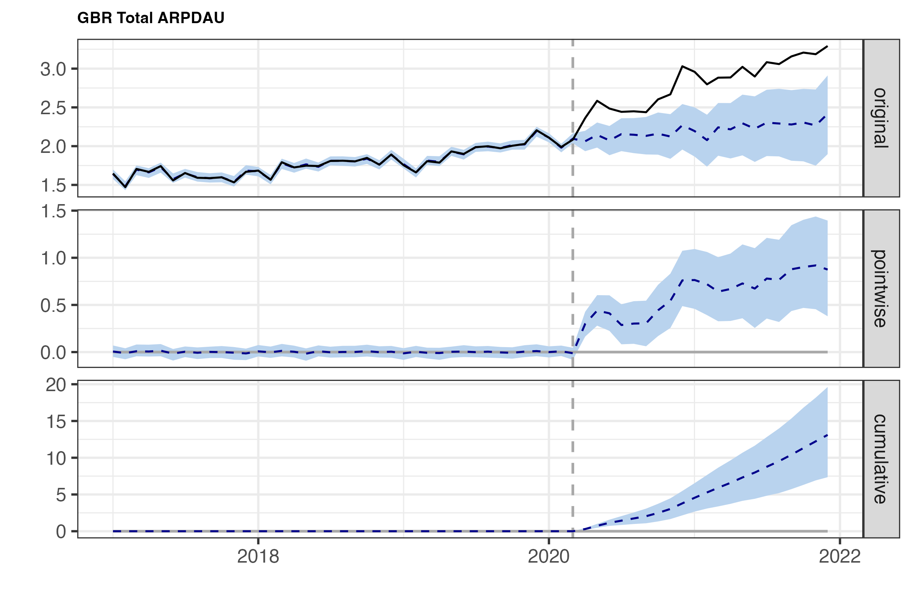
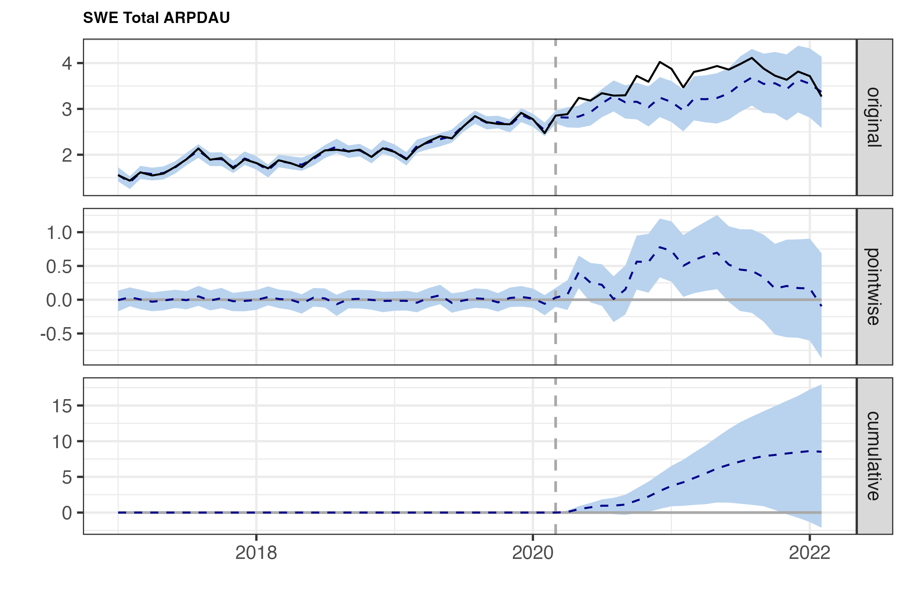
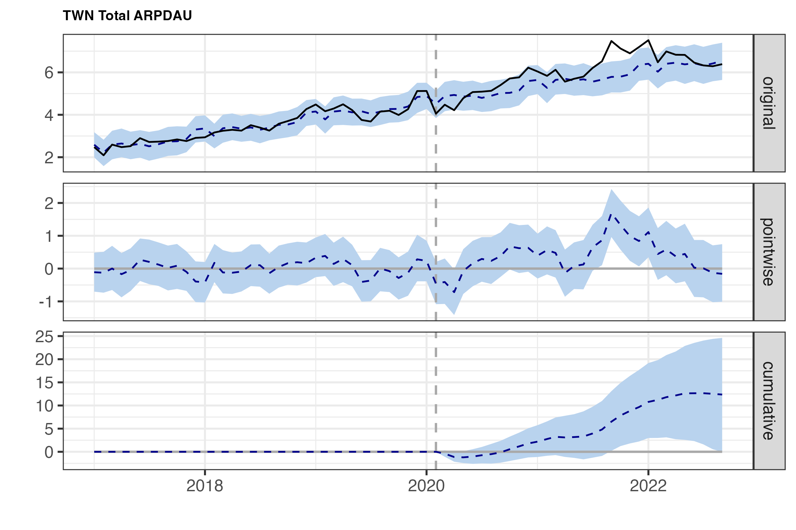

# Leveling Up in Lockdown

**Causal Impact of COVID-19 on the Mobile Gaming Industry**

## Project Overview

This project studies whether the COVID-19 pandemic **truly caused changes** in the mobile gaming industry, rather than just being correlated with existing trends or seasonality.

We use **Bayesian Structural Time Series (BSTS)** together with the **CausalImpact** framework to construct a counterfactual scenario where COVID did not happen, and then compare it with the observed data.

Specifically, we aim to examine:

* Whether COVID led to noticeable changes in mobile gaming metrics
* How large the causal effects were
* Whether the effects were short-term or long-lasting
* Whether the impact differed across countries (USA, UK, Sweden, and Taiwan)


<table>
  <tr>
    <td align="center"><b>USA</b><br>
      
    </td>
    <td align="center"><b>UK</b><br>
      
    </td>
  </tr>
  <tr>
    <td align="center"><b>Sweden</b><br>
      
    </td>
    <td align="center"><b>Taiwan</b><br>
      
    </td>
  </tr>
</table>

<p align="center"><i>Figure A. Raw ARPDAU time series with policy stringency (dashed line) and intervention period (shaded area).</i></p>


## Folder Structure

```bash
├── PDF Documents  
│   ├── Leveling_Up_in_Lockdown.pdf      # Report  
│   └── Slide_Leveling_Up_in_Lockdown.pdf # Presentation slides  
│
├── Developer
│   ├── preprocessing.R # Data loading and preprocessing
│   ├── eda.R           # Exploratory data analysis  
│   ├── bsts.R          # BSTS causal impact analysis  
│   └── simulation.R   # Simulation for model validation  
```

## Results
*Selected results from the full analysis.*
### Average Revenue Per Daily Active User (ARPDAU) (Short-term vs Long-term)
| Country | Short-term Relative Effect (95% CI) | Long-term Relative Effect (95% CI) |
|---|---:|---:|
| USA | +27.2% [+14.2, +41.2] | +13.8% [-5.0, +40.6] |
| UK  | +28.8% [+14.0, +48.9] | +27.2% [-0.1, +70.0] |
| Sweden | +11.9% [-2.3, +27.3] | -4.4% [-21.8, +19.6] |
| Taiwan | +7.2% [+0.3, +15.2] | -4.5% [-11.9, +3.9] |


<table>
  <tr>
    <td align="center"><b>USA</b><br>
      
    </td>
    <td align="center"><b>UK</b><br>
      
    </td>
  </tr>
  <tr>
    <td align="center"><b>Sweden</b><br>
      
    </td>
    <td align="center"><b>Taiwan</b><br>
      
    </td>
  </tr>
</table>

<p align="center"><i>Figure 1–4. Average Revenue Per Daily Active User (ARPDAU): causal impact across the USA, UK, Sweden, and Taiwan.</i></p>


### Key Takeaway
Although the effects differ somewhat across countries, the overall findings suggest that the primary impact of more restrictive governmental policies during the COVID-19 pandemic on the mobile gaming industry was short-term changes in spending behavior among existing users.

The pandemic did not lead to a sustained expansion of the user base. Instead, it temporarily increased the average spending of players who were already active in the market.


